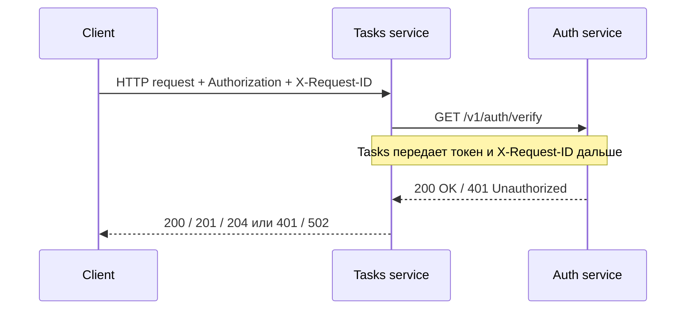
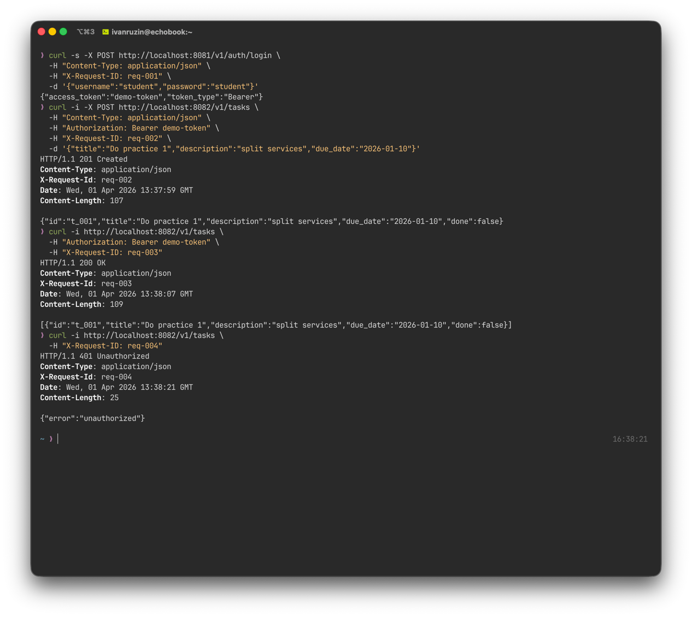
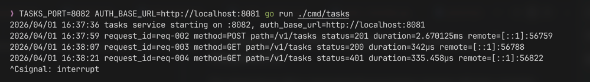
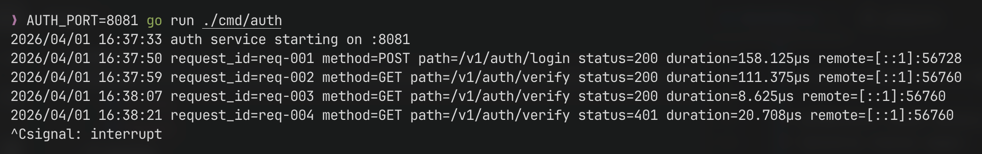

# Практическое занятие №1

# Рузин Иван Александрович ЭФМО-01-25

# Декомпозиция монолитного приложения на 2 микросервиса. Взаимодействие по HTTP

### Что требуется для запуска

Перед началом работы нужно проверить, что в системе есть:

- установленный Go
- утилита `curl`
- свободные порты `8081` и `8082`

### Запуск приложения

Сначала необходимо поднять `Auth Service`.

Из корневой директории проекта выполнить:

```bash
cd services/auth
AUTH_PORT=8081 go run ./cmd/auth
```

После этого в отдельном терминале запустить `Tasks Service`:

```bash
cd services/tasks
AUTH_BASE_URL=http://localhost:8081 TASKS_PORT=8082 go run ./cmd/tasks
```

Для проверки авторизации можно запросить токен:

```bash
curl -i -X POST http://localhost:8081/v1/auth/login \
  -H "Content-Type: application/json" \
  -H "X-Request-ID: req-001" \
  -d '{"username":"student","password":"student"}'
```

---

## 1. Краткое описание границ сервисов

В рамках работы приложение было разбито на два самостоятельных компонента.

`Auth service` отвечает только за упрощенную аутентификацию и проверку токена. Он не хранит задачи и не управляет
бизнес-логикой задач.
`Tasks service` отвечает за создание, получение, изменение и удаление задач. Перед выполнением любой операции сервис
задач обращается в `Auth service` по HTTP для проверки токена. Такое разделение позволяет изолировать ответственность
сервисов и сделать взаимодействие между ними явным через API.

Проверка токена вынесена из `Tasks service` в отдельный сервис. За счет этого логика авторизации не смешивается с
CRUD-операциями.
При каждом защищенном запросе `Tasks service` обращается к `Auth service` по HTTP и запрашивает результат проверки
токена.

Для предотвращения зависания межсервисного взаимодействия используется таймаут.
Для отслеживания одной цепочки запроса в логах применяется заголовок `X-Request-ID`: он приходит от клиента в
`Tasks service`, а затем передается дальше в `Auth service`.

---

## Структура проекта

```text
tip2_pr1/
  README.md
  docs/*
  shared/
    middleware/
      requestid.go
      logging.go
    httpx/
      client.go
  services/
    auth/
      cmd/
        auth/
          main.go
      internal/
        http/
          handler.go
        service/
          service.go
    tasks/
      cmd/
        tasks/
          main.go
      internal/
        client/
          authclient/
            client.go
        http/
          handler.go
        service/
          service.go
  go.mod
  go.sum
```

---

## 2. Схема взаимодействия сервисов



---

## 3. Описание API сервисов

Во всех защищенных запросах используется заголовок:

```text
Authorization: Bearer <token>
```

### Auth service

### POST /v1/auth/login

Используется для упрощенной аутентификации пользователя.
Сервис принимает логин и пароль и при успешной проверке возвращает токен доступа.

### GET /v1/auth/verify

Нужен для проверки переданного токена.
Этот endpoint вызывается сервисом задач перед выполнением операций, требующих авторизации.

### Tasks service

### POST /v1/tasks

Создает новую задачу.
Перед сохранением данных сервис обращается в `Auth service`, чтобы убедиться в валидности токена.

### GET /v1/tasks

Возвращает список всех сохраненных задач.
Запрос выполняется только при успешной проверке авторизации.

### GET /v1/tasks/{id}

Позволяет получить одну задачу по ее идентификатору.

### PATCH /v1/tasks/{id}

Выполняет частичное изменение задачи.
Можно обновлять поля `title`, `description`, `due_date` и `done`.

### DELETE /v1/tasks/{id}

Удаляет задачу по идентификатору.

---

## 4. Проверка CRUD-операций и передачи X-Request-ID

Для демонстрации работы приложения были выполнены основные действия с задачами:

* добавление новой записи
* просмотр списка задач
* обновление существующей задачи
* удаление задачи

В тестовых запросах использовался заголовок `X-Request-ID`.  
При этом идентификатор мог быть как разным для разных запросов, так и одинаковым для демонстрации одной конкретной
цепочки вызова.

Если для одного клиентского запроса указать, например, `X-Request-ID: req-003`, то этот же идентификатор должен
появиться:

- в логах `Tasks service`
- в логах `Auth service`

Это подтверждает, что `Tasks service` корректно прокидывает `X-Request-ID` при обращении к `Auth service`.

## Примеры запросов



## Логи Tasks Service



## Логи Auth Service



По логам видно, что `X-Request-ID` сохраняется на всем пути прохождения запроса, поэтому связать действия клиента,
`Tasks service` и `Auth service` между собой не составляет труда.

